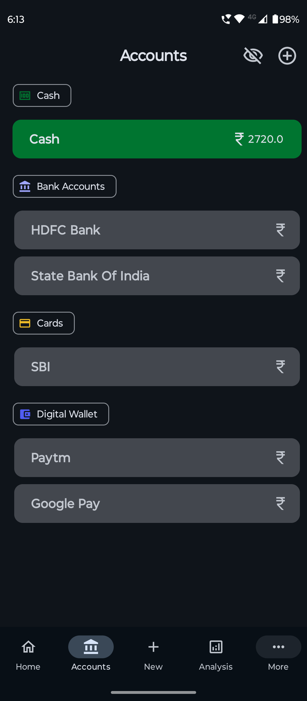
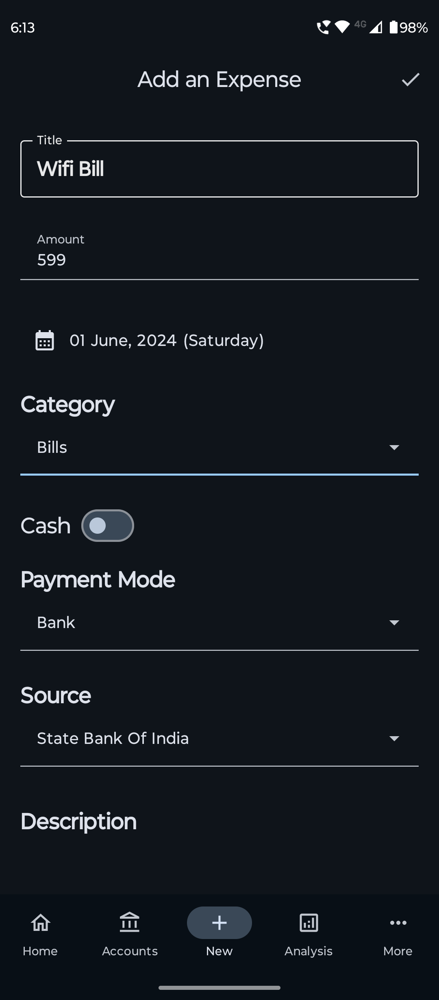
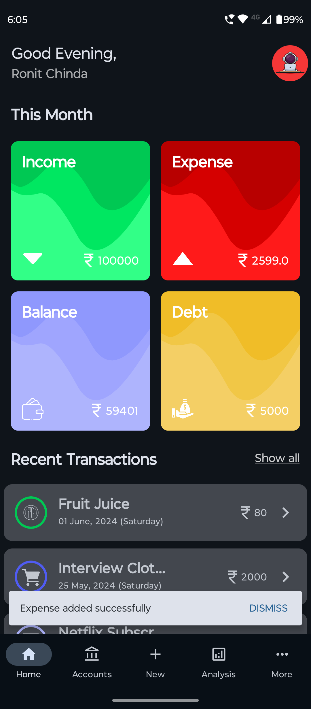
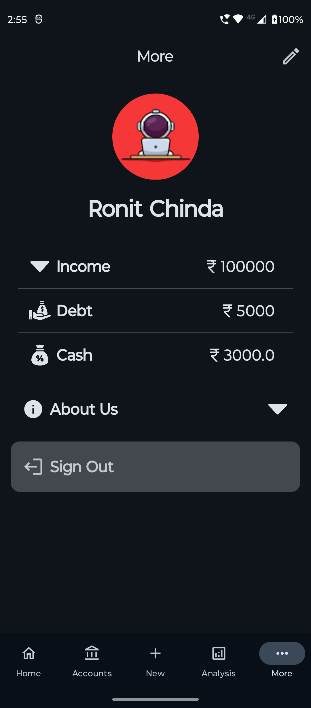
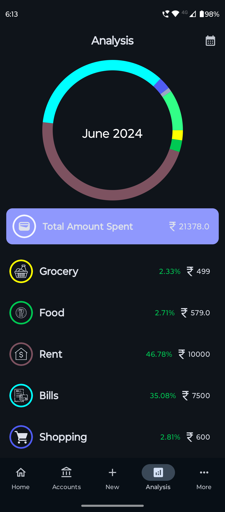
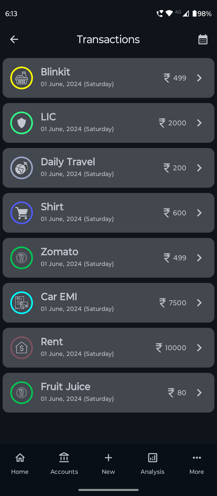

# Penny

## Personal Project

- Penny: an expense tracker to help you monitor your spending.
- Penny allows users to log transactions, manage accounts and provides monthly spending analysis based on predefined categories like groceries, travel, food, shopping, rent, etc.
  
## Tech Stack

- kotlin
- Firebase Authentication
- Firebase Firestore
- Android Studio

## Preview

